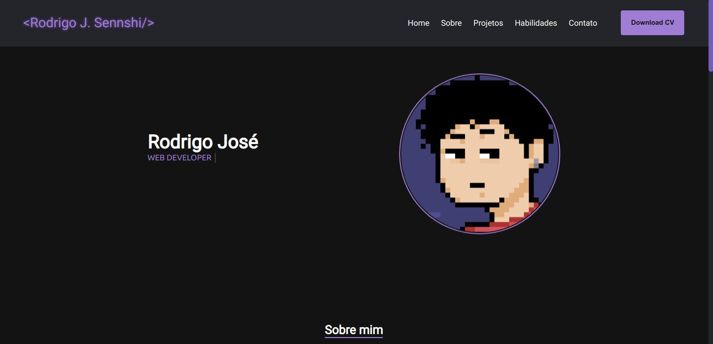

<h1 align="center">
  🖥️ 
  Portfólio - Rodrigo Sennshi
</h1>

  <a href="">Visualizar projeto</a>

---

## Seções presentes
- **Home**: Breve introdução ao portfólio
- **Sobre mim**: Há uma descrição explicando um pouco sobre mim
- **Projetos**: Nesta seção é apresentado alguns projetos feitos por mim, com seus respectivos links para o código fonte presente no GitHub
- **Habilidades**: É apresentado os conhecimentos que possuo e tecnologias que ainda estou estudando, lembrando que estou em um constante fase de aprendizagem com o intuito de melhorar minhas habilidades
- **Contato**: É possível me contantar pelas seguintes redes presentes nessa seção, como por exemplo: linkedin ou email

## Tecnologias utilizadas
Foram utilizadas as seguintes ferramentas/tecnologias no desenvolvimento deste site:
- HTML5
- Javascript
- Sass
- [favicon.io](https://favicon.io/)
- [devicon](https://devicon.dev/)
- [getwaves](https://getwaves.io/)

---

Made with 💜  by Rodrigo Sennshi